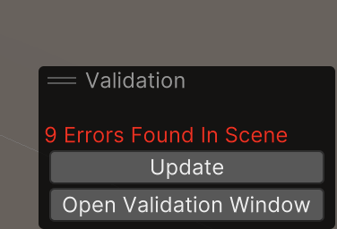
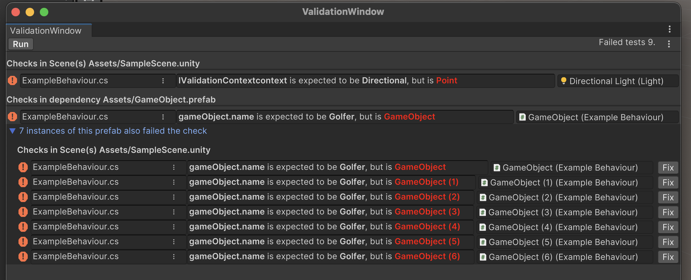

## Writing Validation Checks

There are two ways to add validation checks to your project:

You can a Validator class that inherits from *Validator<T>*. For example, this Validator will report missing materials on Renderers:
```C#
public class RendererValidator : Validator<Renderer>
{
    //This method will be called for any Renderer within the currently open scene or prefab
    protected override void Validate(Renderer renderer, IValidationContext context)
    {
        //Report if any Renderer does not have a material
        context.IsNotNull(renderer.sharedMaterial);
    }
}
```

You can also place your validation logic directly inside of a MonoBehaviour by implementing *IRequireValidation*. This is very handy when you just want to add a quick little check to an existing class.
```C#
public class DontMakeMeStatic : MonoBehaviour, IRequireValidation {
    /*all your regular code goes here*/
    
    //overwrite Validate() to add validation checks to this behaviour
    public void Validate(IValidationContext context) {
        context.IsFalse(gameObject.isStatic);
    }
}
```

The following validation methods are available in IValidationContext:

*  AreEqual(expected, actual)
*  AreNotEqual(expected, actual)
*  IsNotNull(object)
*  IsNull(object)
*  IsTrue(bool)
*  IsFalse(bool)

Each of these messages returns the result of the check. This can be useful for nested checks, like in this example:

```C#
//Ensure that the renderer has a material
if (context.IsNotNull(renderer.sharedMaterial != null))
{
    //if so, check that the material has a texture
    context.IsNotNull(renderer.sharedMaterial.mainTexture);
}
```
By placing the second check inside of the if statement, you prevent a NullReferenceException to be thrown if the material is null.

## SceneValidator
SceneValidato classes allow you to run a check once per scene, instead of once per object of a type. Let's say, we have a mobile game where we want to restrict ourselves to use exactly one light per scene for performance reasons. We could add the following check to the project:

```C#
public class OneLightValidator:SceneValidator{
    public override void DoValidation(IValidationContext context)
    {
        context.AreEqual(1, Object.FindObjectsOfType<Light>().Length);
    }
}
```

## Error message generation
The Validation system generates error messages based on the source code. In a lot of cases, these messages can be good enough out of the box. For example, this code
```C#
context.AreEqual(LightType.Directional, light.type);
//This code will generate the following error message:
//"Light.type was expected to be Directional, but is Point"
```

You can improve the readability of your error messages by choosing a good name for the variables that go into the validation.
```C#
bool lightPointsDown = Vector3.Angle(Vector3.down, light.transform.forward) < 90;
context.IsTrue(lightPointsDown);
//This code will generate the following error message:
//"lightPointsDown was expected to be true, but is false" 
```

However, you can also provide a custom callback for error message generation:
```C#
context.AreEqual(LightType.Directional, light.type, errorText:()=>"Only Directional lights, please!");
```

## Severity
It is possible to overwrite the severity of a validation issue. By default, everything is treated like an error, but you can overwrite it to be a warning instead.
```C#
//report a warning if game object is not called Golfer
context.AreEqual("Golfer", gameObject.name, severity: ValidationSeverity.Warning);
```

## Auto Fixes
Sometimes it is possible to provide an issue to be fixed by code. In this case, you can overwrite the optional parameter *autoFix*. A button labeled "Fix" will apperar in the Validation Results window.
```C#
//report if the game object is not called Golfer. 
context.AreEqual("Golfer", gameObject.name, autoFix: ()=>{gameObject.name = "Golfer";});
 ```

## The Validation Overlay
When adding the package to your project, this overlay is available in your scene view. It refreshes automatically when you open or save a scene or prefab. You can also click "Update" to re-run validation manually.
Clicking "Open Validation Window" opens the Validation Window, which gives you a detailed report of the errors.



## The Validation Window
The Validation Window gives you an overview over all the issues in the open scene or prefab. 
Please note that the issues are grouped by the Object or Asset they appear in. 

The first issue in the screenshot happens directly inside of SampleScene.unity. 

However, the second error happens inside of a prefab called "GameObject.prefab". The identical check also fails for 7 instances of said prefab inside of the scene. You can open the foldout group to see the individual instances of the prefab that fail this check. However, you most likely want to fix this check inside of the prefab.
When the issue is fixed inside of the prefab, it will also fix the issue in the scene. 

