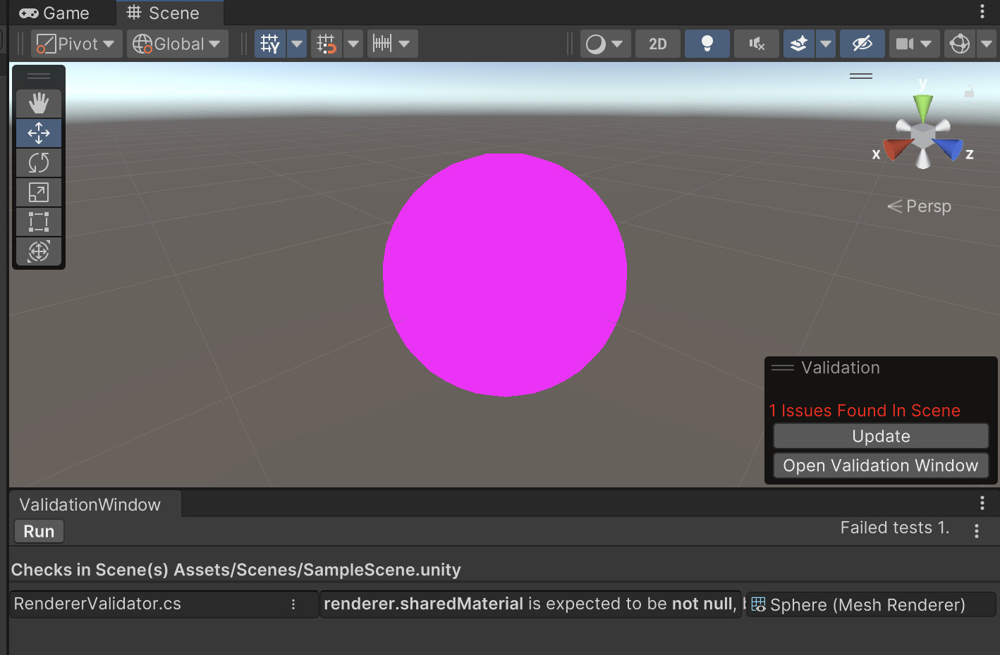
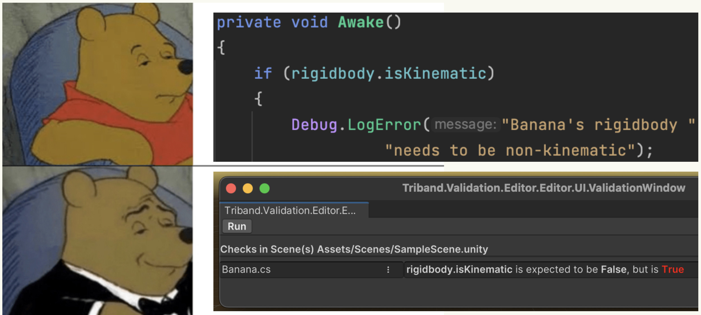

# Validation
### A simple integrity test framework for game content



If you have a million renderers spread over hundreds of scenes, a single missing material can stay undetected for a long time. 
This package is Triband's approach to catching this and similar issues earlier and in an automated way.

*Think unit tests for game content.*

## Writing Validation Checks

There are two ways to add validation checks to your project:

You can a Validator class that inherits from *Validator<T>*. For example, this Validator will report missing materials on Renderers:
```C#
public class RendererValidator : Validator<Renderer>
{
    //This method will be called for any Renderer within the currently open scene or prefab
    protected override void Validate(Renderer renderer, IValidationContext context)
    {
        //Report if any Renderer does not have a material
        context.IsNotNull(renderer.sharedMaterial);
    }
}
```

You can also place your validation logic directly inside of a MonoBehaviour by implementing *IRequireValidation*:
```C#
public class DontMakeMeStatic : MonoBehaviour, IRequireValidation {
    /*all your regular code goes here*/
    
    //overwrite Validate() to add validation checks to this behaviour
    public void Validate(IValidationContext context) {
        context.IsFalse(gameObject.isStatic);
    }
}
```

See the [Documentation](Documentation~/Documentation.md) for a full overview of features.

# Why use this?
Let's say, a script requires to be placed on a non-kinematic rigidbody and the game breaks if you add it to a kinematic one.

The common way to handle this potential setup error (if it's handled at all) would be for the script to log an error from Awake()/Start(). 

However, this requires entering play mode and checking the log for errors, so there is good chance that it will be missed. The Validation system tells you about the error at edit time.


## SerializedField validation
Another feature that is really useful is the validation of Serialized Fields. This allows you to, for example, define a generic validation check that is run for each serialized field of every script in the project. 
You can, for example define a check that states that "No Serialized Field in any script is allowed to contain a null reference". This essentially eleiminates the pain of searching for broken references. 
Have a look at the NullReferenceCheck example provided in this package for an example on how to set this up.

# Integration with CI
By default, validation run for the currently open scene or prefab when it is opened or saved. 
However, you can also hook it up to Unity's unit test system. to do so, add the following code to your package manifest:

```.json
"testables": [
    "com.triband.validation"
],
```
Now a test will show up in the Test Runner window for each level. If you run unit tests as part of your build process, any failed validation check with *severity* set to *Error* will fail the test.
By default, this will add a test for each level that is referenced in the Build Settings. 
However, create a class that overwrites *IValidationSystemSceneProvider* and provide your own list of scenes. 

It is up to your build pipeline how to treat/report the failed tests. 